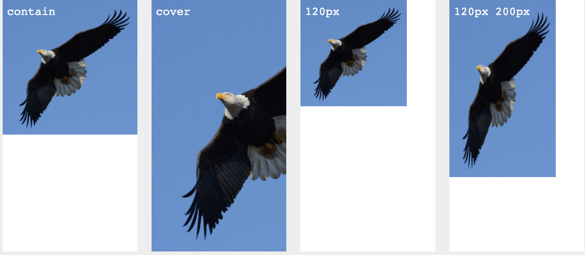

# CSS3 速查笔记

## 一、阴影

#### 1. 文字阴影

> 文本阴影:阴影水平位移 垂直位移 模糊程度 阴影颜色

```
text-shadow: 4px 4px 3px #e8910e;
```


> 文字的阴影可以设置多个,每个阴影按照正常的语法格式进行书写，多个阴影之间使用逗号隔开

```
text-shadow: -1px -1px 1px #fff,1px 1px 1px #000;
```


#### 2. 盒子阴影

> box-shadow :阴影的水平位移 垂直位移 模糊程度 阴影大小 阴影颜色 inset（内阴影）(默认是外阴影)

```
box-shadow: 0 5px 8px rgb(96, 129, 221);
```


## 二、背景

#### 1. 背景尺寸

```
background-size: 宽 高;
500px  500px
50% 50%  百分比是相对于盒子自身的宽高的
cover: 覆盖   保证背景图片会等比例完全铺满盒子,不保证可以完整显示图片
contain: 包含  保证背景图片等比例最大化的 在盒子中完整是显示，不保证铺满盒子
```



#### 2. 背景原点

```
background-origin: 用于指定背景图片从那个盒子开始平铺
border-box: 背景图片的摆放以border区域为参考(默认值)
padding-box: 背景图片的摆放以padding区域为参考
content-box: 背景图片的摆放以content区域为参考
```


#### 3. 背景裁剪

```
background-clip: 用于指定背景图片从那个盒子开始平铺
border-box: 背景图片的摆放以border区域为参考(默认值)
padding-box: 背景图片的摆放以padding区域为参考
content-box: 背景图片的摆放以content区域为参考
```


#### 4. 多背景

```
多背景： 每个背景按照 正常的语法格式书写，多个背景之间使用逗号隔开
背景层级：先写的背景层级高，后写的层级低，通过过控制背景的属性先后顺序来控制层级；

background:
url(images/bg1.png) no-repeat left top,
url(images/bg2.png) no-repeat right top,
url(images/bg3.png) no-repeat right bottom,
url(images/bg4.png) no-repeat left bottom,
url(images/baby0.jpg) no-repeat center center,
url(images/bg5.png) no-repeat center center;
```

## 三、过渡属性

```
transition: 过渡属性  持续时间 延迟  运动曲线;
transition: all 1s;
all:所有的属性都发生过渡

transition-property: 过渡的属性 all  width
transition-duration: 持续时间 1s
transition-delay: 过渡延迟执行1s;
transition-timing-function: 运动曲线
    linear 线性匀速
    ease-in-out　先加速 后减速
    transition-delay: 延迟执行
```

## 四、渐变属性

#### 1. 线性渐变

```
background-image: linear-gradient(to top,yellow,green);
linear-gradient(方向，起始颜色，终止颜色);
    方向：to left   to right  to top   to bottom 　角度　30deg
    起始颜色
    终止颜色
```


#### 2. 径向渐变

```
background-image: radial-gradient(shape size at position, start-color, ..., last-color);
radial-gradient(辐射半径,中心点位置，起始颜色，终止颜色);
    中心点位置：
    at center left top right bottom
    at 50px  50px
    辐射半径：
    shape 50px
    shape 50px 100px
```

## 五、2D 转换

> 如果多个属性发生过渡，多个属性连写，之间使用空格隔开

`transform:translate(-200px,200px) rotate(45deg);`

#### 1. 缩放 scale

```
transform: scale(2,0.5);
transform: scale(水平缩放比例，垂直缩放比例);
    如果只有一个值，等比例缩放
    不能使用百分比
    大于1放大，小于1缩小
```

#### 2. 变换位移 translate

```
transform: translate(-50%,-50%);
transform: translate(-100px,-100px);
transform: translate(水平位移，垂直位移）；
如果只有一个值，只会水平方向发生位移
可以使用百分比，相对于盒子自身而言的
正值 向下向右   负值 向上向左
```

#### 3. 变换位移 translate

```
transform:rotate(-45deg);
角度 deg
正值  顺时针
负值  逆时针
```

#### 4. 扭曲 skew

```
transform:skew(30deg,0deg);
skew(水平角度，垂直的角度)
规律： 当前方向设置了扭曲的角度后，当前这把条边的角度不变，另一条边会产生要给夹角
```

#### 5. 设置变换中心

```
transform-origin:left;  /*变换中心*/
取值：left  top center  right bottom    50px 50px；
```

## 六、3D 转换

```
所有的3d旋转，对着正方向去看，都是顺时针旋转
透视: 加给变换的父盒子
透视 设置的 用户 眼睛和屏幕的距离
仅仅只是视觉呈现出3d 效果，并不是正真的3d
perspective: 600px;
perspective-origin: 0 0;
```

```
沿着x轴旋转
transform:rotateX(360deg);
沿着y轴旋转
transform:rotateY(360deg);
沿着z轴旋转
transform:rotateZ(360deg);

沿x轴位移
transform:translateX(300px);
沿Y轴位移
transform:translateY(300px);
沿Z轴位移
translateZ必须配合透视来使用
transform:translateZ(300px);
```

```
transform-style:preserve-3d;\
可以让里面的子盒子保持3d 效果，加给父盒子
preseve-3d: 让子盒子 位于3d空间里面
flat： 子盒子被扁平化


backface-visibility:hidden 背面不可见
```

## 七、动画

```
animation:move 1s  alternate linear 3 ;
animation: 动画名称 持续时间  执行次数(infinite:无限次)  是否反向  运动曲线 延迟执行
```

```
css3中的动画使用：
    类似js中的函数：
    ---先定义 ---再调用
    js 定义函数：
        function donghua(){ 函数体}
    调用： donghua();

    CSS3中的动画：
    定义动画：
        @keyframes 动画名{
            from{ 初始状态}
            to{结束状态}
         }
        @keyframes 动画名{
            0%{ 初始状态}
            100%{结束状态}
         }

     调用：基本语法格式
     animation: 动画名称 持续时间;
```

```
动画名称： animation-name: move
单次动画执行时间：animation-duration: 2s;
重复次数  animation-iteration-count: 1;   infinite 无数次
动画方向：animation-direction    alternate 交替  normal 正常的
动画延迟：animation-delay: 1s;
动画结束后的所保持的状态：
animation-fill-mode:
    backwards: 保持动画开始前的状态
    forwards: 保持动画结束后的状态
运动曲线：animation-timing-function
linear 匀速  ease-in-out :先加速后减速  steps
steps(ｎ) 让动画分步完成
animation-timing-function: steps(15);
动画的播放状态 ：paused 暂停 running 运行
animation-play-state: paused;
```
