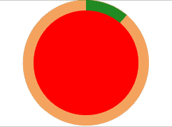
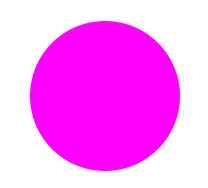
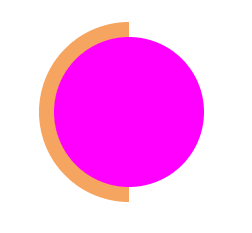
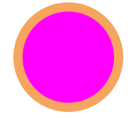
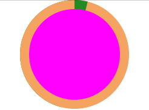

# CSS 实现圆形进度条

## 示例图



## 结构

首先一个父级 div 设置相对定位，内部含有四个半圆 div 和一个用于遮罩的小圆 div

## 实现步骤

- 先写出基本 html 结构

```
<div class="box">
  <div class="bg1"></div>
  <div class="bg2"></div>
  <div class="pr1"></div>
  <div class="pr2"></div>
  <div class="content"></div>
</div>
```

- 父级 div 和 content 添加样式

```
.box{
  position: relative;
}
.content {
  top: 10px;
  left: 10px;
  width: 100px;
  height: 100px;
  border-radius: 50%;
  position: absolute;
  background:red;
  z-index: 5;
}
```

当前效果：


- 添加第一个背景半圆

```
.bg1{
  position: absolute;
  width: 60px;
  height: 120px;
  border-radius: 120px 0 0 120px;
  z-index: 3;
  background: sandybrown;
}
```



- 添加第二个背景半圆

```
.bg2{
  left: 60px;
  position: absolute;
  width: 60px;
  height: 120px;
  border-radius: 0px 120px 120px 0;
  z-index: 1;
  background: sandybrown;
}
```



- 添加第一个进度半圆，这个时候，去页面调整 rotate 的角度可以看到进度旋转

```
.pr1 {
  position: absolute;
  left: 60px;
  width: 60px;
  height: 120px;
  border-radius: 0px 120px 120px 0px;
  z-index: 2;
  background: forestgreen;
  transform: rotate(-180deg);
  transform-origin: 0px 60px;
}
```



- 添加第二个半圆，第一个半圆只能旋转到 50%，所以需要第二个半圆来走完剩下的一半

```
.pr2 {
  position: absolute;
  left: 60px;
  border-radius: 0px 120px 120px 0px;
  z-index: 4;
  background: forestgreen;
  transform: rotate(-180deg);
  transform-origin: 0px 60px;
}
```

- 添加动画函数，在分别把动画函数添加到.pr1 和.pr2 中，在实际需求中可以用 js 控制连个进度半圆的旋转角度

```
.pr1 {
...
animation: pr1A 5s infinite linear forwards;
}
.pr2 {
...
animation: pr2A 5s infinite linear forwards;
}
@keyframes pr1A {
  0% {
    transform: rotate(-180deg);
  }
  50% {
    transform: rotate(0deg);
  }
  100% {
    transform: rotate(0deg);
  }
}
@keyframes pr2A {
  0% {
    transform: rotate(-180deg);
  }
  100%{
    width: 60px;
    height: 120px;
    transform: rotate(180deg);
  }
}
```

以上完成

[1]: /img/bVbxYOu
[2]: /img/bVbxYQc
[3]: /img/bVbxYQl
[4]: /img/bVbxYQq
[5]: /img/bVbxYSd
